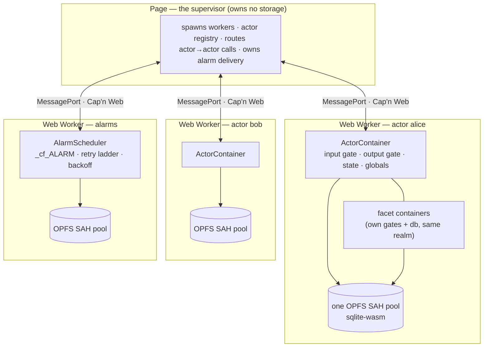

# do-runtime

Cloudflare's Durable Object runtime, ported from [workerd](https://github.com/cloudflare/workerd) to TypeScript, so the same actors run in a browser tab and in Node.

[](https://github.com/WebMCP-org/do-runtime/actions)
[](LICENSE)

A Durable Object is an actor: one identity, one private SQLite database, one event at a time, reachable by name. That model only ran inside Cloudflare's edge. `do-runtime` is the runtime underneath it — input and output gates, implicit transactions, facets, alarms, Worker Loader, the `cloudflare:workers` module — rebuilt over two storage substrates: **sqlite-wasm on OPFS** inside a Web Worker, and **`node:sqlite`** in a Node process. Its behaviour is pinned by one conformance suite that runs against real workerd, against Node, and against headless Chromium, so "the same semantics" is something the tests assert rather than something this README claims.

It was extracted from Rook, SigVelo's AI agent for Chrome, which needed real Durable Object semantics under Cloudflare's Agents SDK inside a Chrome extension. Cloudflare, Workers, Durable Objects, and workerd are Cloudflare's; this is an independent port and is not affiliated with or endorsed by Cloudflare.

## Contents

- [The model: actors, and what a Durable Object adds](#the-model-actors-and-what-a-durable-object-adds)
- [How it runs in the browser](#how-it-runs-in-the-browser)
- [Quickstart](#quickstart)
- [Hosting an actor](#hosting-an-actor)
- [Storage, alarms, facets, I/O](#storage)
- [What is not supported, and stability](#what-is-not-supported)
- [Package layout](#package-layout)
- [Tests](#tests)
- [Development](#development)
- [Acknowledgements and license](#acknowledgements)

## The model: actors, and what a Durable Object adds

An **actor** is the oldest answer to concurrency that does not involve locks: a unit of identity plus private state that processes one message at a time and talks to other actors only by sending messages. Nothing outside an actor can touch its state, so there is nothing to race. Erlang processes, Akka actors, Orleans grains, and Durable Objects are all this shape.

A **Durable Object** is an actor with four things bolted on, and this package ports all four:

| | What it means | Where it lives here |
| --- | --- | --- |
| **Named identity** | `idFromName("alice")` always means the same actor, and the id names its storage. | `ActorContainerOptions.id` + `uniqueKey`, `src/server/actor-id-impl.ts` |
| **Private transactional storage** | A SQLite database only this actor can open. KV and SQL on the same file; writes coalesce into an implicit transaction that commits at the end of the event. | `src/io/actor-sqlite.ts`, `src/api/sql.ts`, `src/util/` |
| **Input and output gates** | The single-threaded illusion survives `await`. The input gate admits one event at a time (and re-admits a continuation only through a gated primitive); the output gate holds a reply until the write it could reveal is durable. | `src/io/io-gate.ts`, `src/io/io-context.ts` |
| **Alarms and facets** | `setAlarm()` wakes the actor later with retries and backoff. Facets are child actors under a root: own gates, own database, one tree index. | `src/server/alarm-scheduler.ts`, `src/server/facet-*.ts` |

Two consequences fall out of the gates and are the whole reason the runtime is more than a SQLite wrapper:

- **No interleaving.** If a method awaits storage, a second call on the same actor waits. Application code reads and writes state without locks and is still correct.
- **No phantom reads.** A reply that could expose a write does not leave until that write is committed. A crash between "returned" and "committed" cannot lie to a caller.

Everything else in the package serves those two lines.

## How it runs in the browser

Workerd gives every actor its own isolate, so `setTimeout`, `fetch`, and `scheduler.wait` can only ever mean the one actor in that isolate. The browser equivalent is **one root actor per Web Worker**, with the page acting as the supervisor workerd's `Server` is:



Why it is shaped this way:

- **The page cannot hold storage.** OPFS synchronous access handles — the only way to run SQLite synchronously in a browser — exist only inside a dedicated worker. So the page is a pure supervisor: it creates workers, keeps the registry, and routes `alice → bob` calls. It is the offscreen document's job in a Chrome extension and `Server`'s job in workerd.
- **One root actor per worker.** The worker entry calls `installActorScope(globalThis, () => container.globals)`, which installs gated `setTimeout`, `clearTimeout`, `setInterval`, `clearInterval`, `fetch`, `crypto`, and `scheduler` as the worker's ambient globals. With one root per realm the ambient is unambiguous, which is exactly why workerd gets this for free and why application code — and any SDK it pulls in — needs no changes.
- **Facets stay in their parent's worker**, as they stay in their parent's isolate upstream. A facet is a separate `ActorContainer` with its own gates and its own database prefix inside the parent's pool; what it shares is the JavaScript realm and the root's synchronous facet-tree index, which is what lets a facet have facets of its own.
- **Alarms get their own worker** because the scheduler needs a database and a database needs a worker. Setting an alarm is one durable row there; delivery comes back through the supervisor, which places the target actor if it is not running.
- **Every hop is `MessagePort` + [Cap'n Web](https://github.com/cloudflare/capnweb).** Each worker is booted with one raw `postMessage` carrying its port; everything after is a capability-based RPC session opened by `newRpcSession()`. A container's `entry(instance)` proxy is what sits behind the session, so every call from outside is one gated event.

Boot order inside an actor worker is load-bearing; each inversion below is a measured failure, not a style choice:

1. Capture raw platform timers at module scope and build the `Timer` port on them — a `Timer` that reads the installed globals recurses once the scope is in.
2. Set `globalThis.sqlite3ApiConfig = { disable: { vfs: { opfs: true, "opfs-wl": true } } }` before touching sqlite — only the SAH pool is wanted, and the other two VFSes spawn workers and arm watchdogs of their own.
3. `sqlite3InitModule()` and `installOpfsSAHPoolVfs(...)` **before** `installActorScope` — the installer arms watchdogs through the global `setTimeout`, which must not yet be the actor's gate.
4. `installActorScope(globalThis, resolve)` with a `resolve` that throws when the container is gone, so a torn-down worker refuses instead of falling through to raw timers.
5. Application pool settings, not the conformance lane's test-only ones: a stable pool name (it becomes an OPFS directory name), `clearOnInit: false`, capacity sized to two databases per root plus journals. The pool takes exclusive sync access handles — one holder per pool; a second context fails to install.

`conformance/browser/` is that picture, runnable: [`host.ts`](conformance/browser/host.ts) is the page, [`actor.worker.ts`](conformance/browser/actor.worker.ts) is a worker hosting one actor tree over OPFS, [`alarms.worker.ts`](conformance/browser/alarms.worker.ts) is the scheduler, and [`protocol.ts`](conformance/browser/protocol.ts) is the three RPC surfaces between them.

## Quickstart

Not on npm yet — exports are TypeScript source, so consume from git (`pnpm add github:WebMCP-org/do-runtime`) or copy the tree. Requires Node ≥ 24.11 (for `node:sqlite`).

```ts
import { DurableObject } from "@mcp-b/do-runtime/cloudflare-workers";
import { createActorContainer, DEFAULT_ALARM_OUTLET, noFacets, type Timer } from "@mcp-b/do-runtime";
import { createNodeSqlProvider } from "@mcp-b/do-runtime/backends/node-sqlite";

class Counter extends DurableObject {
  async increment(): Promise<number> {
    const next = ((await this.ctx.storage.get<number>("n")) ?? 0) + 1;
    await this.ctx.storage.put("n", next);
    return next;
  }

  // SQL is on the same storage, inside the same implicit transaction.
  async history(): Promise<number> {
    this.ctx.storage.sql.exec("CREATE TABLE IF NOT EXISTS hits (at INTEGER)");
    this.ctx.storage.sql.exec("INSERT INTO hits VALUES (?)", Date.now());
    return this.ctx.storage.sql.exec("SELECT count(*) AS c FROM hits").one().c as number;
  }
}

// The host supplies the substrate: a clock, a database provider, alarm and facet outlets.
const timer: Timer = {
  now: () => Date.now(),
  afterDelay: (ms, signal) =>
    new Promise((resolve) => {
      const handle = setTimeout(resolve, ms);
      signal?.addEventListener("abort", () => clearTimeout(handle));
    }),
};

const container = await createActorContainer({
  id: "counter-1",
  uniqueKey: "my-app", // keep this stable forever: every DurableObjectId is derived from it
  exports: {},
  env: {},
  ports: {
    sql: createNodeSqlProvider({ directory: "./data" }),
    alarms: DEFAULT_ALARM_OUTLET, // refuses — a real host passes AlarmScheduler.hooks("counter-1")
    facets: noFacets, // refuses — a real host constructs a child container per request
    timer,
  },
});

const counter = container.entry(await container.start((ctx, env) => new Counter(ctx, env)));
await counter.increment(); // 1
await counter.increment(); // 2
```

Open a second container over the same directory and `increment()` answers `3`: the instance was volatile, the storage was not. In a browser the only line that changes is `sql`, which becomes `createSqliteWasmProvider(pool, { prefix: "/counter-1" })` from `@mcp-b/do-runtime/backends/sqlite-wasm`.

## Examples

Two runnable browser hosts live in [`examples/`](examples/), each with its own README and Playwright e2e (`pnpm test:examples`):

- [`examples/extension/`](examples/extension/) — a Chrome MV3 extension: service worker → offscreen document (with corpse recovery) → worker hosting a `Counter` actor with a real `AlarmScheduler`. Proves the MV3 CSP story (`'wasm-unsafe-eval'`), OPFS persistence across reloads, and alarm delivery with the persisted retry ladder.
- [`examples/vibe-platform/`](examples/vibe-platform/) — a self-contained vibe-coding page: a `Workspace` actor stores an app's source files in its SQLite storage and serves them through its real `fetch()` handler; `@rolldown/browser` bundles them in-page and a sandboxed iframe renders the result. Its COOP/COEP headers exist for the in-page bundler's shared memory — the runtime and the SAH pool need none.

## Hosting an actor

The runtime owns semantics; the host owns placement and substrate. `createActorContainer()` is asynchronous because the database opens asynchronously, and a returned container is fully initialised — there is no half-started state.

| Option | What the host supplies |
| --- | --- |
| `id` | The actor's stable name (`idFromName` input). |
| `uniqueKey` | The namespace key every id is derived from. Change it and every actor loses its data. |
| `exports` | The `ctx.exports` class registry, built from `LoopbackDurableObjectClass`. |
| `env` | The bindings the constructor receives. Assign `container.workerLoader(...)` onto it if the actor needs a Worker Loader. |
| `ports.sql` | A `SqlDatabaseProvider`: `backends/node-sqlite` or `backends/sqlite-wasm`. |
| `ports.alarms` | `AlarmScheduler.hooks(id)` for a root actor. Facets have no alarm slot. |
| `ports.facets` | A `FacetHost`: place a child container, abort it, copy or delete its storage. |
| `ports.timer` | `now()` and `afterDelay()`, captured below any installed actor scope. |
| `ports.fetch` | Optional global outbound. Absent means `fetch` refuses by name, as a Worker with `globalOutbound: null` does. |
| `facet` | Present when constructing a local child: its id, depth, and the root-owned `FacetTree`. |

The lifecycle:

1. `await createActorContainer(options)`.
2. `container.start((ctx, env) => new ActorClass(ctx, env))` once, under boot semantics (input gate held for the constructor, deletion receipts replayed first).
3. Expose `container.entry(instance)` to callers. Every method call through it is one gated event.
4. Use `container.run(fn)` for events that are not method calls: a WebSocket frame, a host callback.
5. Reach the platform through `container.globals` (or install it with `installActorScope`). For a host-provided promise an actor must await, wrap it once in `container.awaitIo()`.
6. Watch `container.onBroken`; dispose the placement; recreate it on the next event over the same storage.

### Storage

`SqlDatabaseProvider.open(name)` is the only seam. The runtime owns database names, tables, transactions, reset behaviour, and facet metadata; the host chooses the physical provider and prefix. Stored KV values are JSON-compatible only — V8-only types are rejected at `put()` rather than stored lossily. `_cf_` names are reserved to the runtime.

The browser provider takes an already-installed OPFS SAH pool (`installOpfsSAHPoolVfs`; sync access handles in a dedicated worker — no cross-origin isolation or `SharedArrayBuffer` needed). One pool per worker; the root and each local facet get separate prefixes inside it. The Node provider uses in-memory databases by default and a directory when asked.

### Alarms

Construct one `AlarmScheduler` per namespace over a `SqlDatabase` of its own. It owns `_cf_ALARM`, delivery, retry counts (`ALARM_RETRY_MAX_TRIES`), exponential backoff with jitter, and abandonment. Pass `scheduler.hooks(id)` as a root actor's `ports.alarms`, and give the scheduler a `getActor(id)` that places the actor if it is not running — an alarm is a reason to wake a Durable Object, not something that needs one awake already. A browser host may project the scheduler's current one-shot wait onto a physical timer (`chrome.alarms`, say) but must not duplicate delivery policy.

### Facets

`ctx.facets.get(name, () => ({ $class: ctx.exports.Child }))` asks `ports.facets.start()` for a placement. The host answers with a `FacetHandle` whose `stub` is a promise — placement is asynchronous while the API stays synchronous, so a constructor failure surfaces on the first method call. The runtime owns ids (stable across delete-and-recreate), depth and name limits, clone, cascading deletion, durable deletion receipts, and stale-reference fencing. A broken facet takes its descendants down and nothing else: never its parent, never its siblings.

### Actor-scoped I/O, and the one trap

On workerd every awaitable thing is an io-context primitive, so "resuming from an await re-enters with a fresh input lock" never needs saying. Here it does. A raw `setTimeout` resolves a promise the runtime does not own; the continuation resumes with an empty invocation stack and the next `ctx.storage` call throws `no input lock available in this context`. That is by design — the alternative is a continuation that silently writes outside the gate.

`container.globals` is the complete gated set, bound to that container: `setTimeout`/`clearTimeout`/`setInterval`/`clearInterval` capture the critical section when armed and re-enter when fired; `scheduler.wait()` and `scheduler.yield()` resume under the actor; `fetch()` waits for output locks and releases the input gate while in flight; `crypto` re-enters on async completion; accepted WebSocket frames enter through the captured context. Install it as the worker's globals (`installActorScope`) when one worker hosts one root, or hand it to application code explicitly when it must not.

## What is not supported

The browser cannot reproduce every workerd facility. Where it cannot, the runtime **fails closed**: the API exists, throws a named error that the conformance suite asserts on every lane, and never silently does less.

| Area | Contract here |
| --- | --- |
| Hibernatable WebSockets | Unsupported; named methods throw. Use memory-only sockets and reconnect. |
| Point-in-time recovery, replication, SQL ingest | Unsupported by local SQLite; named methods throw. Bookmarks are development counters, not recovery points. |
| Actor-class stub serialization | Throws; needs workerd's serializer and channel tokens. |
| Module-scope `waitUntil`, `cache`, `abortIsolate`, Workers RPC stub constructors | Named `cloudflare:workers` boundaries throw. |
| `DurableObjectState.abort()` | Breaks later storage and re-entry; cannot synchronously terminate the calling JavaScript slice. |
| Stored values | JSON-compatible only; V8-only types are rejected at write time. |
| Reserved SQL names | `_cf_` detected from tokenized SQL text, which can reject more than workerd's authorizer. |
| Response BYOB readers | Refused; their continuation cannot be re-gated. Use a default reader or `arrayBuffer()`. |
| Facet `setAlarm()` | Refused synchronously, where workerd breaks the actor asynchronously ([workerd#6810](https://github.com/cloudflare/workerd/issues/6810)). |
| Alarm exception provenance | Unclassified handler failures stay retryable; browser errors lack jsg provenance. |

### Stability

This is `0.x`. The public surface is what [`src/index.ts`](src/index.ts) and the subpath exports in [`package.json`](package.json) expose; gates, `IoContext`, storage classes, and facet-manager internals are deliberately not exported and may change without notice. While `0.x`, a breaking change to the public surface is a minor bump with a changelog entry. A feature that is removed goes through the same door as the table above — a named refusal in the API and a conformance row — rather than disappearing, so a caller finds out at the call site and not in production. There is one storage shape; missing storage is initialised and present storage is validated, and there are no migration registries or dual reads to carry forward.

## Package layout

| Path | Responsibility |
| --- | --- |
| `src/util/` | SQLite seam, KV tables, metadata helpers |
| `src/io/` | Gates, invocation context, actor storage engine, ids, Worker channels |
| `src/api/` | Workers-facing APIs: `DurableObjectState`, SQL, WebSocket, Worker Loader, `cloudflare:workers` |
| `src/server/` | Actor containers, facet lifecycle, deletion recovery, alarm scheduling |
| `src/transport/` | The one `MessagePort` Cap'n Web session adapter |
| `backends/` | `node:sqlite` and sqlite-wasm/OPFS `SqlDatabaseProvider`s |
| `conformance/` | One suite, three hosts: workerd, Node, browser; plus the probe fixture and benchmarks |
| `examples/` | Runnable browser hosts: an MV3 extension and an in-page vibe-coding platform |
| `docs/decisions.md` | The numbered invariants and decisions that source comments cite (`§1.2`, `decision 8`) |

The `util → io → api → server` direction follows workerd's own layering, enforced with TypeScript project references. Source comments cite the workerd file and line they port (`← io-gate.c++:142`), and every deliberate divergence is recorded beside its implementation and in a conformance row.

## Tests

```bash
pnpm test:unit                  # workerd's own unit tests, ported module by module
pnpm test:conformance-workerd   # the oracle: the suite on real workerd, importing nothing from src/
pnpm test:conformance-node      # the suite on this runtime over node:sqlite
pnpm test:conformance-browser   # the suite in headless Chromium over sqlite-wasm + OPFS, with a real Cap'n Web session
pnpm test                       # all of the above
```

The workerd lane is what makes the others mean something: every row it passes is a contract the Node and browser lanes must also pass, and a substrate that lacks a feature asserts the named refusal instead of skipping the row. `pnpm bench:node` and `pnpm bench:browser` measure `sql.exec` latency over a realistic message store on each substrate.

## Development

```bash
git clone https://github.com/WebMCP-org/do-runtime
cd do-runtime
pnpm install
pnpm exec playwright install chromium   # browser lane only
pnpm typecheck && pnpm test
```

Change runtime behaviour with the corresponding workerd source open (citations use commit `e8f1e125bd48f048a3e82c48d37e5e3902fffbd6`). Ask the workerd lane an observable question before inventing a local rule; record any intentional divergence in the table above and in a conformance row. Keep host seams small and typed, keep gates internal, and keep product knowledge out of the port. See [`docs/decisions.md`](docs/decisions.md) for the invariants the code cites.

## Acknowledgements

- [workerd](https://github.com/cloudflare/workerd) (Apache-2.0) is the source of truth this is ported from, line by line. Its license and attribution are preserved in [LICENSE.workerd](LICENSE.workerd) and [NOTICE](NOTICE).
- [Cap'n Web](https://github.com/cloudflare/capnweb) carries every cross-worker hop.
- [sqlite-wasm](https://sqlite.org/wasm) and its OPFS SAH pool are the browser storage floor.

## License

Kukumis, Inc.'s work is source-available under FSL-1.1-MIT and converts to MIT two years after each version is made available; see [LICENSE](LICENSE). The workerd-derived portions remain subject to Apache-2.0.
