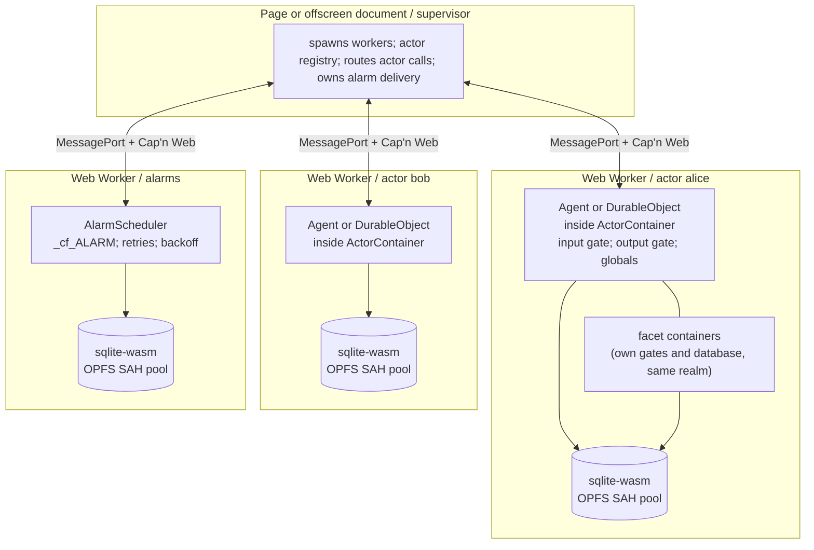
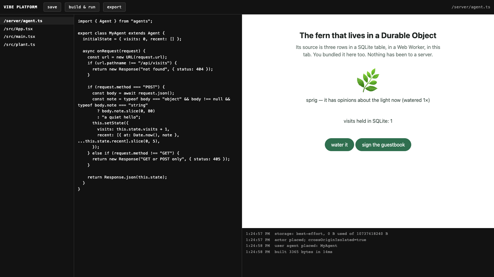

# do-runtime


Cloudflare Durable Objects and Agents SDK code, running locally inside Chrome
extensions and browser tabs.

```ts
import { Agent, callable } from "agents";

export class Counter extends Agent<Cloudflare.Env, { count: number }> {
  initialState = { count: 0 };

  @callable()
  increment() {
    this.setState({ count: this.state.count + 1 });
  }

  @callable()
  async armWake() {
    await this.schedule(5, "scheduledIncrement");
  }

  scheduledIncrement() {
    this.setState({ count: this.state.count + 1 });
  }
}
```

The [Chrome MV3 example](examples/extension/README.md) runs this ordinary Agent
inside a module Worker. `setState()` persists to SQLite on OPFS; SDK calls and
state sync cross a `MessagePort`-backed WebSocket; `schedule()` stores the task
and projects its wake through `chrome.alarms`. Its end-to-end test destroys the
offscreen host before the alarm fires, then proves Chrome rebuilds the runtime
and calls `scheduledIncrement()` against the same state. Cloudflare runs the
same Agent source inside workerd.

[](https://github.com/WebMCP-org/do-runtime/actions)
[](LICENSE)

## The problem

An `Agent` or `DurableObject` class is TypeScript, but its safety comes from the
host around it. [Workerd](https://github.com/cloudflare/workerd) gives every named
object a private SQLite database, serializes events across `await`, holds replies
until their writes commit, delivers alarms, routes object-to-object calls, and
restores hibernatable WebSockets. Cloudflare's Agents SDK relies on those rules.

A browser has the raw components needed to build that host: dedicated workers,
WebAssembly, OPFS, and `MessagePort`. It does not assemble them into a Durable
Object runtime. A storage adapter alone would leave concurrency, commit ordering,
wake-up, and lifecycle behavior undefined. Those differences surface when two
requests overlap, Chrome evicts an extension context, or a reply races the write
it reports.

`do-runtime` supplies that missing host. It ports the relevant Durable Object
behavior from workerd to TypeScript, runs each root actor in a Web Worker, stores
its SQLite database in OPFS, and carries capabilities between workers with
[Cap'n Web](https://github.com/cloudflare/capnweb). Supported `Agent` and
`DurableObject` classes can execute on-device and deploy to Cloudflare from the
same source. A `node:sqlite` backend provides a second local host and a fast test
lane.

The repository contains the runtime and the proofs needed to use it as an
execution target:

| Area | What it contains |
| --- | --- |
| [`@mcp-b/do-runtime`](src/) | Input and output gates, implicit transactions, Durable Object storage APIs, facets, alarms, hibernatable WebSockets, Worker Loader, and `cloudflare:workers`. |
| [`vendor/agents/`](vendor/agents/README.md) | Rook's Agents SDK fork. It consumes the runtime; the runtime package does not import the SDK. |
| [`conformance/`](conformance/) | One behavioral suite run against real workerd, the Node host, and the browser host in Chromium. |
| [`examples/extension/`](examples/extension/README.md) | A Chrome MV3 host with an offscreen supervisor, local Agents SDK actors and sub-agents, OPFS persistence, durable alarms, hibernatable sockets, and restart recovery. |
| [`examples/vibe-platform/`](examples/vibe-platform/README.md) | An in-tab editor that runs a user-authored Agent locally and exports the unchanged source as a Wrangler project. |

This work was extracted from Rook, SigVelo's AI agent for Chrome. Cloudflare,
Workers, Durable Objects, and workerd are Cloudflare's; this is an independent
port and is not affiliated with or endorsed by Cloudflare.

## Contents

- [The browser runtime](#the-browser-runtime)
- [Run it in a browser](#run-it-in-a-browser)
- [Durable Object semantics](#durable-object-semantics)
- [Minimal host](#minimal-host)
- [Hosting an actor](#hosting-an-actor)
- [Storage, alarms, facets, I/O](#storage)
- [Migrations](#migrations)
- [What is not supported, and stability](#what-is-not-supported)
- [Package layout](#package-layout)
- [Tests](#tests)
- [Development](#development)
- [Acknowledgements and license](#acknowledgements)

## The browser runtime

Workerd gives every actor its own isolate, so `setTimeout`, `fetch`, and
`scheduler.wait` always belong to that actor. The reference browser host places
one root actor in each Web Worker. The page, or an extension's offscreen
document, supervises placement and owns no actor storage.



Why it is shaped this way:

- OPFS synchronous access handles exist only inside a dedicated worker, so the
  supervisor creates workers, keeps the registry, and routes calls between them.
- Each root gets its own worker. `installActorScope()` can therefore install the
  actor's gated timers, `fetch`, `crypto`, and `scheduler` as unambiguous ambient
  globals for application and SDK code.
- Facets stay in their parent's worker, matching workerd's isolate layout. Each
  facet still has its own container, gates, and database prefix.
- The reference host gives its alarm scheduler a separate worker because the
  scheduler has durable SQLite state of its own. A single-root host can colocate
  it with the actor worker, as the MV3 example does. Either layout can place a
  sleeping actor when a stored alarm becomes due.
- Each cross-worker call is a capability-based RPC session over a transferred
  `MessagePort`. The proxy exposed by `container.entry(instance)` turns each call
  into one gated actor event.

`conformance/browser/` is that picture, runnable: [`host.ts`](conformance/browser/host.ts) is the page, [`actor.worker.ts`](conformance/browser/actor.worker.ts) is a worker hosting one actor tree over OPFS, [`alarms.worker.ts`](conformance/browser/alarms.worker.ts) is the scheduler, and [`protocol.ts`](conformance/browser/protocol.ts) is the three RPC surfaces between them.

## Run it in a browser

The Chrome MV3 extension is the primary reference host. From a fresh checkout:

```bash
pnpm sdk:setup
pnpm install
pnpm exec playwright install chromium
pnpm --filter do-runtime-example-extension e2e
```

| Example | Browser shape | What the test proves |
| --- | --- | --- |
| [Chrome MV3 extension](examples/extension/README.md) | Service worker -> offscreen document -> actor Worker -> sqlite-wasm/OPFS | An Agents SDK root and its sub-agents retain state across host teardown; alarms wake an evicted host; hibernatable sockets, state sync, callable RPC, queues, MCP, and email routing use the real SDK paths. |
| [In-tab coding platform](examples/vibe-platform/README.md) | Page -> workspace Worker and authored-Agent Worker -> sqlite-wasm/OPFS | A user-authored Agent runs against durable local state, survives code replacement, and exports from the browser as the same source in a Wrangler project. |

Run both browser end-to-end suites with `pnpm test:examples`.

The [in-tab coding platform](examples/vibe-platform/README.md) is the second
composition: an editor, local preview, persisted Agent state, and Wrangler
export, all inside a normal browser tab.



Start it at `http://localhost:5173` with
`pnpm --filter do-runtime-example-vibe-platform dev`.

## Durable Object semantics

An actor has an identity, private state, and one admitted event at a time. A
Durable Object adds the host behavior that keeps those properties true through
asynchronous I/O and process loss:

| | What it means | Where it lives here |
| --- | --- | --- |
| **Named identity** | `idFromName("alice")` always means the same actor, and the id names its storage. | `ActorContainerOptions.id` + `uniqueKey`, `src/server/actor-id-impl.ts` |
| **Private transactional storage** | A SQLite database only this actor can open. KV and SQL share the file; writes coalesce into an implicit transaction that commits at the end of the event. | `src/io/actor-sqlite.ts`, `src/api/sql.ts`, `src/util/` |
| **Input and output gates** | The input gate serializes event slices across `await`. The output gate holds a reply until the write it could reveal is durable. | `src/io/io-gate.ts`, `src/io/io-context.ts` |
| **Alarms and facets** | `setAlarm()` wakes the actor later with retries and backoff. Facets are child actors with their own gates and database under a root. | `src/server/alarm-scheduler.ts`, `src/server/facet-*.ts` |

If a method awaits storage, another call on the same actor waits. Application
code can perform a read-modify-write without adding a lock. A reply that exposes
a write also waits for that write to commit, so a crash cannot leave a caller
holding an acknowledgement for data that never became durable.

## Minimal host

Install with `pnpm add @mcp-b/do-runtime`. The package ships ESM JavaScript and
declarations. The shortest complete host uses the `node:sqlite` backend, which
requires Node 24.11 or newer. Browser hosts place the same container inside a
Web Worker and supply the sqlite-wasm backend shown in the runnable examples.

```ts
import { DurableObject } from "@mcp-b/do-runtime/cloudflare-workers";
import { createActorContainer, DEFAULT_ALARM_OUTLET, noFacets, type Timer } from "@mcp-b/do-runtime";
import { createNodeSqlProvider } from "@mcp-b/do-runtime/backends/node-sqlite";

class Counter extends DurableObject {
  async increment(): Promise<number> {
    const next = ((await this.ctx.storage.get<number>("n")) ?? 0) + 1;
    await this.ctx.storage.put("n", next);
    return next;
  }

  // SQL is on the same storage, inside the same implicit transaction.
  async history(): Promise<number> {
    this.ctx.storage.sql.exec("CREATE TABLE IF NOT EXISTS hits (at INTEGER)");
    this.ctx.storage.sql.exec("INSERT INTO hits VALUES (?)", Date.now());
    return this.ctx.storage.sql.exec("SELECT count(*) AS c FROM hits").one().c as number;
  }
}

// The host supplies the substrate: a clock, a database provider, alarm and facet outlets.
const timer: Timer = {
  now: () => Date.now(),
  afterDelay: (ms, signal) =>
    new Promise((resolve) => {
      const handle = setTimeout(resolve, ms);
      signal?.addEventListener("abort", () => clearTimeout(handle));
    }),
};

const container = await createActorContainer({
  id: "counter-1",
  uniqueKey: "my-app", // keep this stable forever: every DurableObjectId is derived from it
  exports: {},
  env: {},
  ports: {
    sql: createNodeSqlProvider({ directory: "./data" }),
    alarms: DEFAULT_ALARM_OUTLET, // refuses — a real host passes AlarmScheduler.hooks("counter-1")
    facets: noFacets, // refuses — a real host constructs a child container per request
    timer,
  },
});

const counter = container.entry(await container.start((ctx, env) => new Counter(ctx, env)));
await counter.increment(); // 1
await counter.increment(); // 2
```

Open a second container over the same directory and `increment()` answers `3`:
the instance was volatile, the storage was not. Inside an initialized actor
worker, the browser host supplies
`createSqliteWasmProvider(pool, { prefix: "/counter-1" })` from
`@mcp-b/do-runtime/backends/sqlite-wasm`. The supervisor, OPFS pool, and worker
bootstrapping are shown in the browser examples above.

## Hosting an actor

The runtime owns semantics; the host owns placement and substrate. `createActorContainer()` is asynchronous because the database opens asynchronously, and a returned container is fully initialised — there is no half-started state.

| Option | What the host supplies |
| --- | --- |
| `id` | The actor's stable name (`idFromName` input). |
| `uniqueKey` | The namespace key every id is derived from. Change it and every actor loses its data. |
| `exports` | The `ctx.exports` class registry, built from `LoopbackDurableObjectClass`. |
| `env` | The bindings the constructor receives. Assign `container.workerLoader(...)` onto it if the actor needs a Worker Loader. |
| `ports.sql` | A `SqlDatabaseProvider`: `backends/node-sqlite` or `backends/sqlite-wasm`. |
| `ports.alarms` | `AlarmScheduler.hooks(id)` for a root actor. Facets have no alarm slot. |
| `ports.facets` | A `FacetHost`: place a child container, abort it, copy or delete its storage. |
| `ports.timer` | `now()` and `afterDelay()`, captured below any installed actor scope. |
| `ports.fetch` | Optional global outbound. Absent means `fetch` refuses by name, as a Worker with `globalOutbound: null` does. |
| `ports.hibernation` | Optional mirror callbacks for accepted sockets, attachment bytes, auto-response changes, and closure. Omit it when the host never rebuilds a live socket placement. |
| `webSockets` | Socket references and mirrored tags/attachments to register before the new instance constructor runs. |
| `gateHooks` | Optional input/output gate instrumentation for an embedding host. |
| `facet` | Present when constructing a local child: its id, depth, and the root-owned `FacetTree`. |

The lifecycle:

1. `await createActorContainer(options)`.
2. `container.start((ctx, env) => new ActorClass(ctx, env))` once, under boot semantics (input gate held for the constructor, deletion receipts replayed first).
3. Expose `container.entry(instance, signal?)` to callers. Its `ActorEntry<T>` type makes every method return a promise because each call is one gated event. The optional signal is bound to the proxy and cancels only calls still queued for admission.
4. Use `container.run(fn, signal?)` for events that are not method calls: a WebSocket frame, a host callback. Its signal likewise stops only a queued event, not one already running.
5. Reach the platform through `container.globals` (or install it with `installActorScope`). For a host-provided promise an actor must await, wrap it once in `container.awaitIo()`.
6. Watch `container.onBroken`; dispose the placement; recreate it on the next event over the same storage. A failed `blockConcurrencyWhile()` rejects its caller with `BrokenActorError` and breaks the placement with that same error.
7. Before evicting, inspect `container.quiescence()`. Mirror live sockets through `ports.hibernation`, then build the replacement with `webSockets`; do not reconnect or call `acceptWebSocket()` again.

### Browser worker boot order

The order inside an actor worker is load-bearing. Each inversion below has a
measured failure in the browser test lane:

1. Capture raw platform timers at module scope and build the `Timer` port on
   them. Reading the installed globals from that port recurses after the actor
   scope replaces them.
2. Set
   `globalThis.sqlite3ApiConfig = { disable: { vfs: { opfs: true, "opfs-wl": true } } }`
   before initializing sqlite. The host uses the SAH pool; the other OPFS VFSes
   spawn workers and arm watchdogs of their own.
3. Run `sqlite3InitModule()` and `installOpfsSAHPoolVfs(...)` before
   `installActorScope`. The pool installer uses global timers during startup.
4. Install the actor scope with a resolver that throws when its container is
   gone. A torn-down worker must refuse new work instead of falling through to
   ungated platform timers.
5. Use a stable pool name, preserve files with `clearOnInit: false`, and size the
   pool for two databases per root plus journals. The pool owns exclusive sync
   access handles, so another context cannot open it at the same time.

For a standard Durable Object binding, call
`createDurableObjectNamespace(uniqueKey, channel)` and put the result in `env`
and `ctx.exports`. The channel maps each routed id to a placed `Fetcher`; that
binding works directly with Agents SDK `routeAgentRequest()` and
`getAgentByName()`. For an in-realm binding, pass the raw and entered call
thunks to the target's `container.resolveLoopback()`; it invokes the raw
instance only when the exact caller is that target and otherwise owns the callee
entry and caller `awaitIo`. Current slices and transformed continuations resolve
automatically; pass the still-lock-holding structural caller as the third
argument from untransformed post-await code. For an external transport, wrap
its promise with the caller's `container.awaitIo()` so the continuation
re-enters the owning input gate.

### Storage

`SqlDatabaseProvider.open(name)` is the runtime execution seam. The runtime owns database names, tables, transactions, reset behaviour, facet metadata, and streaming `sql.ingest()` statement boundaries; the host chooses the physical provider and prefix. Stored KV values use structured-clone semantics across workerd, Node, and the browser; existing JSON rows remain readable. `_cf_` names are reserved to the runtime.

### Migrations

Wrangler class declarations, application SQL migrations, persisted `Agent.state`,
Agents SDK tables, and runtime-owned tables have separate owners. Application
SQL uses the same Drizzle migration bundle and constructor pattern on Cloudflare
and on this runtime; `do-runtime` adds no application migration registry. See
[`docs/migrations.md`](docs/migrations.md) for the Rook-facing workflow and the
upstream Cloudflare and Drizzle references.

The runtime's own `_cf_` tables are versioned per database file in
`PRAGMA user_version`. [`src/util/sqlite-migrations.ts`](src/util/sqlite-migrations.ts)
brings older files forward before any event enters and refuses storage written by
a newer package version. Application SQL cannot access that runtime-owned stamp.

The browser provider takes an already-installed OPFS SAH pool (`installOpfsSAHPoolVfs`; sync access handles in a dedicated worker — no cross-origin isolation or `SharedArrayBuffer` needed). One pool per worker; the root and each local facet get separate prefixes inside it. `SqliteWasmActorStorage` adds the close, physical delete, and clone operations a local placement host needs around one prefix. The Node provider uses in-memory databases by default and a directory when asked.

Both concrete providers also implement `SqlDatabaseSnapshotProvider`. After the host has stopped the actor, `provider.close()` releases every database handle; `exportSnapshot()` then returns the SQLite images for the whole actor storage scope, and `importSnapshot()` replaces an idle scope. The same snapshot can seed a cold local replica because SQLite images are portable between these providers. Node snapshots require a dedicated directory-backed provider. This is backup/restore and replica seeding, not Cloudflare's time-indexed PITR or continuously updated read replication.

### Alarms

Construct one `AlarmScheduler` per namespace over a `SqlDatabase` of its own. It owns `_cf_ALARM`, delivery, retry counts (`ALARM_RETRY_MAX_TRIES`), exponential backoff with jitter, and abandonment. Pass `scheduler.hooks(id)` as a root actor's `ports.alarms`, and give the scheduler a `getActor(id)` that places the actor if it is not running — an alarm is a reason to wake a Durable Object, not something that needs one awake already.

A suspending browser host can project the scheduler's next wake through `BrowserAlarmCoordinator` from `@mcp-b/do-runtime/browser/alarm-coordinator`. The coordinator journals the physical hop, rejects stale projections, rearms a consumed watchdog, and reconciles after background-worker restart. The host supplies durable journal storage, the physical alarm calls, and delivery back into its scheduler; logical delivery policy remains in `AlarmScheduler`.

### Facets

`ctx.facets.get(name, () => ({ $class: ctx.exports.Child }))` asks `ports.facets.start()` for a placement. The host answers with a `FacetHandle` whose `stub` is a promise — placement is asynchronous while the API stays synchronous, so a constructor failure surfaces on the first method call. The runtime owns ids (stable across delete-and-recreate), depth and name limits, clone, cascading deletion, durable deletion receipts, and stale-reference fencing. A broken facet takes its descendants down and nothing else: never its parent, never its siblings.

### Actor-scoped I/O, and the one trap

On workerd every awaitable thing is an io-context primitive, so "resuming from an await re-enters with a fresh input lock" never needs saying. Here it does. A raw `setTimeout` resolves a promise the runtime does not own; the continuation resumes with an empty invocation stack and the next `ctx.storage` call throws `no input lock available in this context`. That is by design — the alternative is a continuation that silently writes outside the gate.

`container.globals` is the complete gated set, bound to that container: `setTimeout`/`clearTimeout`/`setInterval`/`clearInterval` capture the critical section when armed and re-enter when fired; `scheduler.wait()` and `scheduler.yield()` resume under the actor; `fetch()` waits for output locks and releases the input gate while in flight; `crypto` re-enters on async completion; and `WebSocketPair` creates runtime-owned socket halves. Install it as the worker's globals (`installActorScope`) when one worker hosts one root, or hand it to application code explicitly when it must not.

### Hibernatable WebSockets

`ctx.acceptWebSocket(socket, tags)` enables class-method dispatch and the full
Workers state API: `getWebSockets`, `getTags`, attachments, auto-response pairs
and timestamps, and the hibernatable event timeout. The runtime works without a
hibernation port for hosts that keep a container alive.

An evicting host implements `ports.hibernation` as a mirror. It retains the same
raw socket reference plus copied tags and attachment bytes, drops the old
placement, and supplies that snapshot as `webSockets` on the replacement. The
registry is populated before the constructor, so SDKs can lazily rebuild their
connection wrappers without another upgrade or connect hook. Closed sockets are
removed before `webSocketClose` runs.

`HibernationMirror` is the package's in-memory reference implementation. Seed a
replacement mirror with the prior socket snapshot and auto-response pair, then
pass that mirror to `ports.hibernation` and its `snapshot()` to `webSockets`.
Browser hosts can install the remaining Request/Response upgrade accommodation
from `@mcp-b/do-runtime/browser`; the runtime itself supplies `WebSocketPair`.
Hosts whose actor lives in another Worker can use `MessagePortWebSocket`,
`createMessagePortWebSocketConstructor`, and `serveMessagePortWebSockets` from
`@mcp-b/do-runtime/browser/message-port-websocket`; binary frames stay in
structured clone and each socket gets one dedicated `MessagePort`.

`container.quiescence()` reports armed timers, pending `waitUntil` work, input
lock state, and output-gate breakage without waiting. `drainWaitUntil()` is for
shutdown and intentionally never settles while a live interval remains armed.

Actor bundles can also install `doRuntimeAwaitTransform()` from `@mcp-b/do-runtime/vite`. A production build checks the final module graph and fails with transformed/total counts for any included module with an uncovered await; the development transform warns once per module if a transformed await reaches its fail-open path without an actor lock.

## What is not supported

The browser cannot reproduce every workerd facility. Where it cannot, the runtime **fails closed**: the API exists, throws a named error that the conformance suite asserts on every lane, and never silently does less.

| Area | Contract here |
| --- | --- |
| Cloudflare point-in-time recovery and read replication | Unsupported by local SQLite; named methods throw. Bookmarks are development counters, not recovery points. |
| Actor-class stub serialization | Throws; needs workerd's serializer and channel tokens. |
| Module-scope `waitUntil`, `cache`, `abortIsolate`, Workers RPC stub constructors | Named `cloudflare:workers` boundaries throw. |
| `DurableObjectState.abort()` | Breaks later storage and re-entry; cannot synchronously terminate the calling JavaScript slice. |
| Stored value wire bytes | Browser-safe versioned structured-clone encoding rather than V8's private format; public value types align and legacy JSON rows remain readable. |
| SQL row counters | Local `rowsRead`/`rowsWritten`, including `sql.ingest()`, use returned rows and SQLite changes; workerd uses unavailable libsql billing counters. |
| Reserved SQL names | `_cf_` detected from tokenized SQL text, which can reject more than workerd's authorizer. `ANALYZE` on a reserved table is refused where workerd allows it. |
| Authorizer-only SQL forms | `ATTACH`, `DETACH`, the temp-schema creations (both `CREATE TEMP …` and the `temp.` qualifier), `VACUUM`, and virtual-table modules outside upstream's four (`fts5`, `fts5vocab`, `rtree`, `rtree_i32`) are refused from the leading keyword, with workerd's own messages. These reach the authorizer's own decisions — action codes and its temp-schema rule — rather than `SqlStorageRegulator` callbacks, so porting the regulator did not carry them. The refused and allowed forms are matched through SQLite's identifier quoting, whitespace or none. `EXPLAIN` in front of a refused form still compiles here, where workerd's authorizer refuses it. |
| SQL function allowlist | Not enforced. Workerd's authorizer denies any function outside its 138-name `ALLOWED_SQLITE_FUNCTIONS` list; this runtime allows every function the backend compiled, including build-detail readers such as `sqlite_version()` and `sqlite_source_id()`. |
| PRAGMA allowlist | Workerd's allowlist enforced from tokenized SQL text. A `pragma_*` table-valued function with a string or bound argument is authorized by pragma name only, where workerd's authorizer also sees the resolved argument; the pinned conformance row is the contract. |
| Node SQLite length limit | Bound and returned strings and blobs are capped at 4 MiB; `node:sqlite` cannot cap an unreturned SQL-computed value. The browser backend uses SQLite's native limit. |
| Response BYOB readers | Refused; their continuation cannot be re-gated. Use a default reader or `arrayBuffer()`. |
| Facet `setAlarm()` | Refused synchronously, where workerd breaks the actor asynchronously ([workerd#6810](https://github.com/cloudflare/workerd/issues/6810)). |
| Alarm exception provenance | Unclassified handler failures stay retryable; browser errors lack jsg provenance. |

### Stability

This is `0.x`. The public surface is what [`src/index.ts`](src/index.ts) and the subpath exports in [`package.json`](package.json) expose; gates, `IoContext`, storage classes, and facet-manager internals are deliberately not exported and may change without notice. While `0.x`, a breaking change to the public surface is a minor bump with a changelog entry. A feature that is removed goes through the same door as the table above — a named refusal in the API and a conformance row — rather than disappearing, so a caller finds out at the call site and not in production. Runtime storage is versioned per database file (`PRAGMA user_version`, decision 19): every open brings an older file forward through forward-only migration steps before anything reads it, present storage is then validated against the current shape, and a file stamped by a newer release refuses with the one remedy named.

## Package layout

| Path | Responsibility |
| --- | --- |
| `src/util/` | SQLite seam, KV tables, metadata helpers |
| `src/io/` | Gates, invocation context, actor storage engine, ids, Worker channels |
| `src/api/` | Workers-facing APIs: `DurableObjectState`, SQL, WebSocket, Worker Loader, `cloudflare:workers` |
| `src/server/` | Actor containers, facet lifecycle, deletion recovery, alarm scheduling |
| `src/browser/` | Physical alarm projection, offscreen-document recovery, and MessagePort-backed WebSockets for browser hosts |
| `src/transport/` | The one `MessagePort` Cap'n Web session adapter |
| `backends/` | `node:sqlite` and sqlite-wasm/OPFS `SqlDatabaseProvider`s |
| `conformance/` | One suite, three hosts: workerd, Node, browser; plus the probe fixture and benchmarks |
| `examples/` | Runnable browser hosts: an MV3 extension and an in-page vibe-coding platform |
| `docs/migrations.md` | How Rook evolves Wrangler declarations, application SQL, and persisted Agent state without duplicating Cloudflare's migration machinery |
| `docs/decisions.md` | The numbered invariants and decisions that source comments cite (`§1.2`, `decision 8`) |

The `util → io → api → server` direction follows workerd's own layering, enforced with TypeScript project references. Source comments cite the workerd file and line they port (`← io-gate.c++:142`), and every deliberate divergence is recorded beside its implementation and in a conformance row.

## Tests

```bash
pnpm test:unit                  # workerd's own unit tests, ported module by module
pnpm test:conformance-workerd   # the oracle: the suite on real workerd, importing nothing from src/
pnpm test:conformance-node      # the suite on this runtime over node:sqlite
pnpm test:conformance-browser   # the suite in headless Chromium over sqlite-wasm + OPFS, with a real Cap'n Web session
pnpm test                       # all of the above
```

The workerd lane is what makes the others mean something: every row it passes is a contract the Node and browser lanes must also pass, including cross-root RPC gate release and resumption. The browser smoke lane also fills the real OPFS SAH pool to capacity and proves visible failure, no leaked slot, and recovery. A substrate that lacks a feature asserts the named refusal instead of skipping the row. `pnpm bench:node` and `pnpm bench:browser` measure `sql.exec` latency over a realistic message store on each substrate.

## Development

```bash
git clone https://github.com/WebMCP-org/do-runtime
cd do-runtime
pnpm sdk:setup
pnpm install
pnpm exec playwright install chromium   # browser lane only
pnpm typecheck && pnpm test
pnpm sdk:check && pnpm sdk:test          # Rook's Agents SDK fork
```

The repository has two independently tested layers: the runtime at the root
and Rook's six-package Agents SDK fork in
[`vendor/agents/`](vendor/agents/README.md). The examples consume the fork's
built `agents` package through a `file:` dependency, which resolves their
own peer dependencies without installing a second SDK implementation.

Change runtime behaviour with the corresponding workerd source open (line citations use release `v1.20260713.1`; the conformance oracle is pinned to `v1.20260820.1`). Ask the workerd lane an observable question before inventing a local rule; record any intentional divergence in the table above and in a conformance row. Keep host seams small and typed, keep gates internal, and keep product knowledge out of the port. See [`docs/decisions.md`](docs/decisions.md) for the invariants the code cites.

## Acknowledgements

- [workerd](https://github.com/cloudflare/workerd) (Apache-2.0) is the source of truth this is ported from, line by line. Its license and attribution are preserved in [LICENSE.workerd](LICENSE.workerd) and [NOTICE](NOTICE).
- [Cap'n Web](https://github.com/cloudflare/capnweb) carries every cross-worker hop.
- [sqlite-wasm](https://sqlite.org/wasm) and its OPFS SAH pool are the browser storage floor.

## License

Kukumis, Inc.'s work is source-available under FSL-1.1-MIT and converts to MIT two years after each version is made available; see [LICENSE](LICENSE). The workerd-derived portions remain subject to Apache-2.0.
